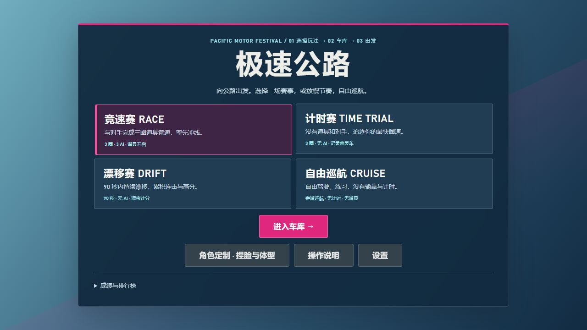
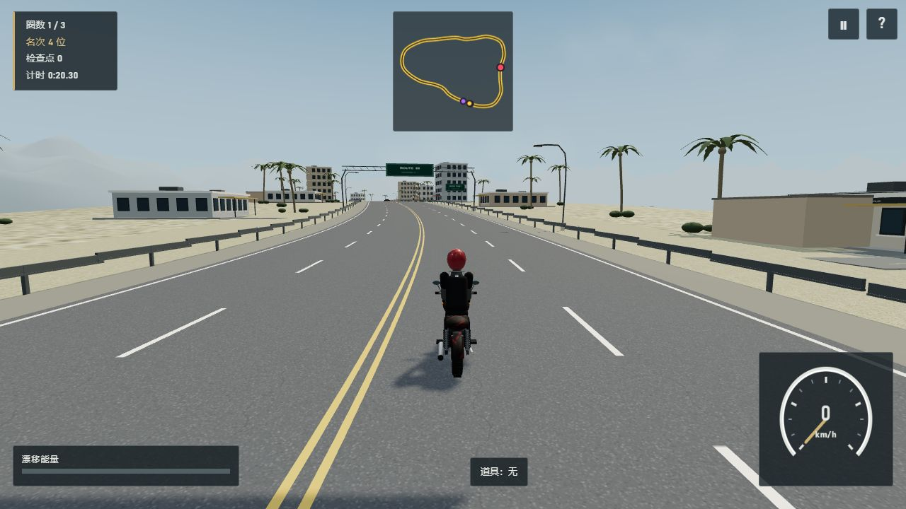
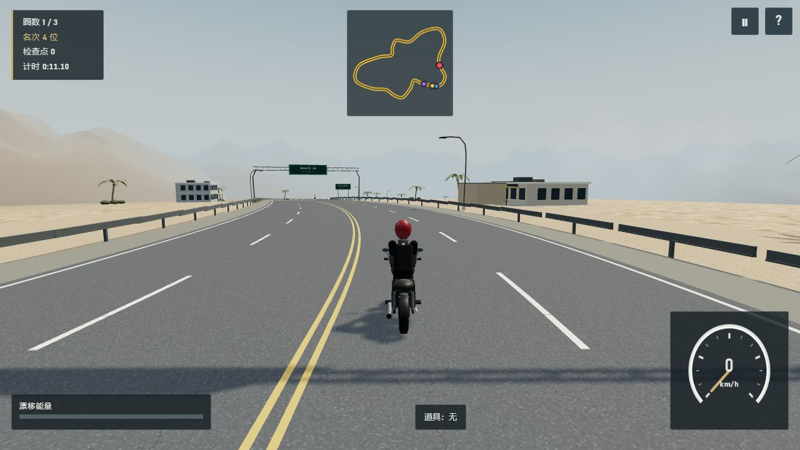
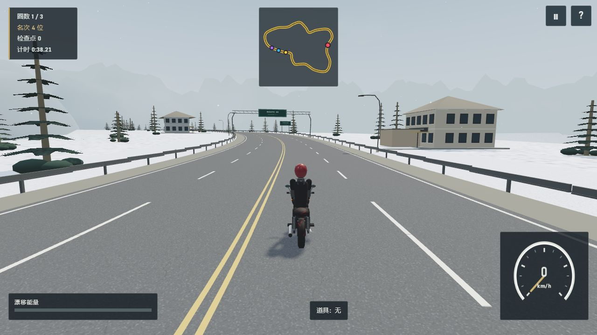
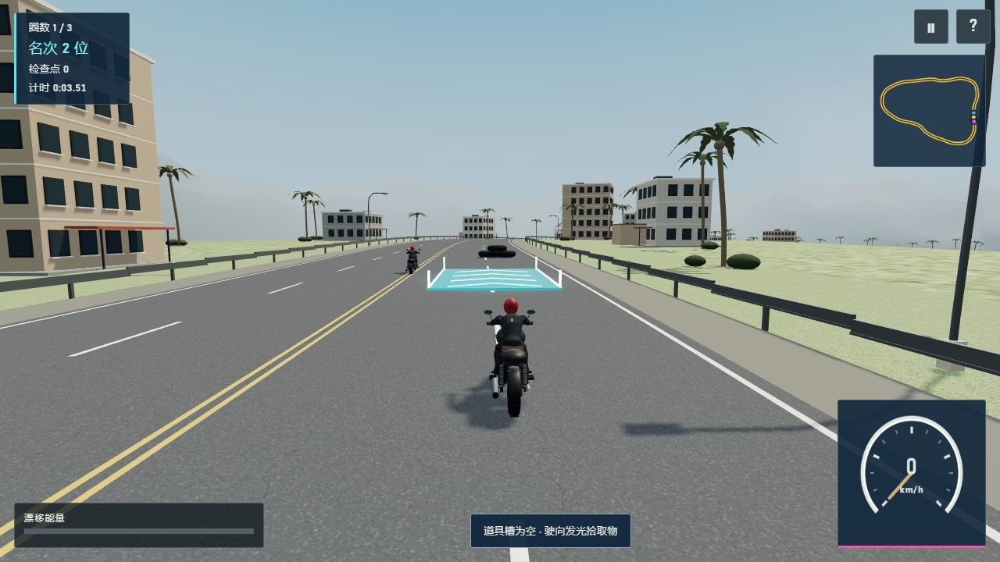
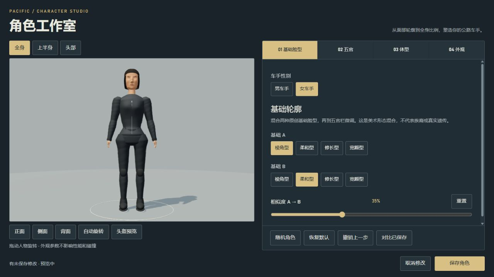
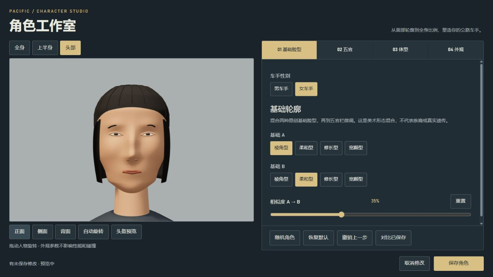

<div align="center">

# 极速公路
### HIGHWAY HEROES · PACIFIC EDITION

**向公路出发。竞速、压弯，或放慢节奏，自由巡航。**

基于 Three.js 的浏览器 3D 摩托竞速游戏  
四种玩法 · 三款摩托 · 三套公路主题 · 可定制车手

`Three.js r168` · `TypeScript` · `Vite` · `WebGL2`

[快速开始](#快速开始) · [实机画廊](#实机画廊) · [角色工作室](#角色工作室) · [开发指南](#开发指南) · [设计文档](docs/README.md)



<sub>公路嘉年华菜单 · 项目实机截图</sub>

</div>

---

## 一场属于你的公路骑行

在海岸城区、荒漠公路与高山隘口之间选择路线，驾驶复古街车、攀爬车或运动跑车出发。通过漂移积累氮气，用加速带抢占路线，或在道具竞速中寻找反超机会。

Pacific 版本采用自然光照、分层材质与局部交互光晕：道路保持清晰，车辆保留机械细节，道具在高速驾驶时也有明确的形状和颜色。

| 驾驶与竞争 | 外观与氛围 |
|---|---|
| **四种模式**：竞速、计时、漂移、自由巡航 | **三款摩托**：不同车身结构、配色和预设车衣 |
| **道具博弈**：导弹、护盾、加速、地雷 | **角色定制**：男女外形、脸型、全身体型与衣着 |
| **圈速挑战**：本地最佳记录与计时赛幽灵车 | **渐变阵雨**：雨量、雨声与画面逐渐变化 |
| **清晰反馈**：流动加速箭头、光晕与导弹尾迹 | **赛博装备**：哑光全盔、青色视窗灯带与尾灯 |

> **当前版本：人物自然化 V2 · 2026-09-09**  
> 当前是可运行的单机迭代版本，采用轻量程序化模型。不是无缝开放世界，也不以 GTA／Forza 同等级写实精度作为已完成成果。

## 实机画廊

<table>
  <tr>
    <td width="50%">
      
      <br><b>COASTAL · 海岸都会环线</b><br>
      <sub>棕榈、建筑与开阔道路，构成城市边缘的骑行风景。</sub>
    </td>
    <td width="50%">
      
      <br><b>DESERT · 荒漠州际公路</b><br>
      <sub>暖色地形与层叠远山，让路线延伸进荒漠。</sub>
    </td>
  </tr>
  <tr>
    <td width="50%">
      
      <br><b>ALPINE · 高山隘口</b><br>
      <sub>雪地、针叶树与冷色山体，切换另一种驾驶氛围。</sub>
    </td>
    <td width="50%">
      
      <br><b>BOOST · 抓住加速窗口</b><br>
      <sub>流动箭头与侧灯突出加速带，保留道路中央视野。</sub>
    </td>
  </tr>
</table>

<sub>以上均为项目实机截图，无 AI 效果图。场景图记录于美术重制阶段，加速带图记录于嘉年华阶段；其中部分 HUD 和车手早于当前版本。最新人物见下方，完整拍摄阶段见 <a href="docs/VERIFICATION.md">验证记录</a>。</sub>

## 四种玩法

| 模式 | 规则 | 你的目标 |
|---|---|---|
| **RACE · 竞速赛** | 3 圈 · 3 名 AI · 携带道具开启 | 读线、进攻与反超，争夺终点名次 |
| **TIME TRIAL · 计时赛** | 3 圈 · 无 AI · 无携带道具 | 挑战有效圈速，对照幽灵车改善走线 |
| **DRIFT · 漂移赛** | 90 秒 · 无 AI · 漂移计分 | 连续压弯，积累连击与高分 |
| **CRUISE · 自由巡航** | 无限时 · 无 AI · 无携带道具 | 熟悉路线，练习驾驶，随时退出 |

关闭携带道具的模式仍保留道路加速带与障碍。成绩保存在当前浏览器，不是在线排行榜。

**更容易理解的规则**

- 导弹优先选择前方最近的未完赛车手，前方无人时转向后方；无有效目标不消耗。选敌按环路位置判断，不按排行榜名次，仍受航程限制。
- 非雪地从干燥开局进入随机渐变阵雨，不再经过某个路段就突然下雨；高山路线保留下雪。
- 最终冲线后车辆停驶，经过 **2 秒有效游戏时间**显示结算，不等待所有 AI；暂停不计入这段时间。
- 氮气需要蓄能与油门；护盾当前用于拦截导弹，不是对所有碰撞免疫。

## 角色工作室

不仅是修改五官，也能调整整位车手的轮廓。

<table>
  <tr>
    <td width="50%">
      
      <br><b>BODY · 全身轮廓</b><br>
      <sub>肩、胸、腰、胯与四肢比例共同塑造车手外形。</sub>
    </td>
    <td width="50%">
      
      <br><b>FACE · 面部细节</b><br>
      <sub>独立下颌与颧面轮廓、眼睑、鼻口及几何发型。</sub>
    </td>
  </tr>
</table>

<sub>两张截图均来自当前人物自然化 V2。</sub>

- **基础与五官**：男女车手、4 种原创基础脸型混合、12 项五官参数。
- **体型与衣着**：10 项全身体型参数，165–190 cm 身高范围，肤色、发型、配色与服装选项。
- **预览与编辑**：全身／上半身／头部，正侧背视图，旋转、头盔预览、单项重置、撤销与已保存对比。
- **确认再生效**：草稿编辑，保存后用于车库与比赛；取消不覆盖原角色。

外观参数不改变驾驶性能或碰撞尺寸。当前人物使用 17 个控制关节与骑乘约束，仍是风格化程序模型，不包含真人扫描皮肤、真实毛发或动态布料。详见 [角色工作室说明](docs/CHARACTER-STUDIO.md)。

## 车库

| 摩托 | 设计定位 | 车衣预设 |
|---|---|---|
| **Cafe Custom 88** | 复古街车，外露机械结构 | Cyber Matte 88 · 赛博哑光 |
| **Desert Scrambler** | 越野／攀爬车轮廓 | Sunset Classic 07 · 落日条纹 |
| **RS Sport 200** | 全包围运动跑车 | Volt Division 27 · 伏特蓝 |

独立轮组随速度转动，漆面、金属、橡胶和皮革分别处理；车衣主要影响漆面件。当前模型为新的 Three.js 网格，原包 GLB 作为源参考保留，不是对原 CAD 模型完成了人工精修拓扑。

## 快速开始

### 直接试玩

下载仓库中的 [Highway-Heroes-Pacific.html](Highway-Heroes-Pacific.html)，使用桌面 Chrome／Edge 打开。该文件内嵌游戏所需资源，约 25.9 MiB，不需要安装前端依赖。

GitHub 文件页用于查看／下载文件，不会直接运行游戏。如果浏览器限制本地资源，在已安装 Node.js 的电脑上，把终端切换到项目根目录后运行：

```bash
node serve.mjs --portable --no-open
```

打开 **http://127.0.0.1:5189/offline.html**。这个方式只依赖根目录的单文件成品，不要求已存在 `frontend/dist/`。退出时按 `Ctrl+C`。

### 从源码启动

电脑需要 Node.js 与 npm。在下载或克隆的项目根目录执行：

```bash
cd frontend
npm ci
npm run dev
```

打开终端显示的开发地址，并访问 **`/offline.html`**，例如 `http://localhost:5173/offline.html`。实际端口以终端输出为准。

> 首次点击界面后浏览器才可能允许播放声音。请开启硬件加速并使用支持 WebGL2 的浏览器。单文件、不同端口和不同浏览器之间不保证共享本地存档。

## 操作

| 操作 | 键盘 | 标准 Xbox 手柄映射 |
|---|---|---|
| 转向 | A / D 或 ← / → | 左摇杆 / 十字键 |
| 油门 / 刹车 | W / S 或 ↑ / ↓ | RT / LT |
| 漂移 | Space / Shift / X | A |
| 使用道具 | E / J | X |
| 氮气 | Q，同时按油门且蓄能足够 | Y |
| 暂停 | Esc / P | Start |
| 返回 | Esc | B |

保留触屏与标准手柄输入实现；当前验证以 Windows 桌面 Chromium 为主，真实手机与实体手柄尚需专项测试。

## 开发指南

### 常用命令

以下命令均在 `frontend/` 目录执行。

| 命令 | 用途 |
|---|---|
| `npm run dev` | 启动开发服务 |
| `npm run typecheck` | TypeScript 类型检查 |
| `npm test` | 运行 Vitest 测试 |
| `npm run build` | 类型检查并生成 `frontend/dist/` |
| `npm run preview` | 预览构建结果，访问 `/offline.html` |
| `npm run check` | 类型检查、测试与构建 |
| `npm run build:portable` | 构建网页，并生成根目录独立 HTML |

从源码克隆后，`frontend/dist/` 通常不存在，因为它被 Git 忽略。先构建，再使用依赖该目录的 `START-GAME.cmd`；直接试玩则使用上面的 `--portable` 方式。

### 技术结构

```text
highway-heroes/
├── README.md                      # GitHub 项目首页
├── Highway-Heroes-Pacific.html     # 内嵌资源的独立试玩版
├── serve.mjs                      # 本机静态服务
├── START-GAME.cmd                  # Windows 启动入口，需已有 dist
├── frontend/
│   ├── src/
│   │   ├── core/                  # 主循环、模式、输入与事件
│   │   ├── entities/              # 摩托、人物、头盔与骑乘约束
│   │   ├── render/                # 材质、道路、环境与天气
│   │   ├── items/                 # 拾取、导弹、护盾与地雷
│   │   ├── race/                  # 圈数、检查点、排名与结算
│   │   ├── ui/                    # 菜单、HUD 与角色工作室
│   │   ├── settings/              # 设置和人物存档
│   │   ├── records/               # 本地成绩
│   │   ├── ghost/                 # 幽灵车录制与回放
│   │   └── audio/                 # 引擎、环境音与音乐
│   ├── public/                    # 保留素材与静态资源
│   ├── tests/                     # 自动化回归测试
│   └── scripts/                   # 构建与资源工具
├── previews/                      # 本页引用的实机截图
└── docs/                          # GDD、素材清单与验证记录
```

Three.js r168 负责三维渲染，TypeScript + Vite 组织应用；UI 使用原生 DOM／CSS。自然材质、ACES 色调映射与远景雾取代旧卡通描边，实例化、材质合批和分块显隐控制渲染开销。游戏逻辑采用固定 60 Hz 步进。

### 部署边界

构建输出包含两个不同入口：

- **`offline.html`**：本地单机入口，配合完整 `dist/` 资源目录使用。
- **`index.html`**：公开版同样直接启动单机游戏，不包含企业登录或后端接口。

当前 README 不提供未经核验的在线试玩地址，也不表示已发布到 GitHub Pages。只上传源码或 README 不会自动部署游戏。

**GitHub 公开版**：已移除企业登录脚本、内部平台接口、后端及平台专用配置。保留浏览器本地成绩与完整单机玩法；原私人工作副本未改动。部分 docs 保留历史阶段记录，当前公开范围以 [公开版说明](docs/PUBLIC-EDITION.md) 为准。

## 文档与验证

| 想了解什么 | 阅读入口 |
|---|---|
| 全部文档 | [docs 目录索引](docs/README.md) |
| 游戏规则与设计范围 | [GDD · Pacific 当前版](docs/GDD-游戏设计文档-Pacific.md) |
| 美术、材质与场景 | [美术方向](docs/ART-DIRECTION.md) |
| 人物定制与保存 | [角色工作室](docs/CHARACTER-STUDIO.md) |
| 当前人物迭代 | [人物自然化 V2](docs/CHARACTER-NATURAL-V2.md) |
| 素材分组与来源 | [素材清单](docs/assets-manifest.json) |
| 测试、截图版本与限制 | [验证记录](docs/VERIFICATION.md) |
| 更详细的版本说明 | [README-PACIFIC](README-PACIFIC.md) |

**最近一次公开版自动检查：2026-09-09，类型检查通过，10 个测试文件共 48 项通过，网页与独立 HTML 构建通过。**  
覆盖角色存档、几何预算、三车骑乘、导弹选敌、随机天气和冲线冻结。这是本地运行记录，不是持续集成状态，也不代替完整人工跑圈或多设备性能验收。

## 下一步

- [ ] 继续改善人物近景、衣着细节与极端体型下的穿插。
- [ ] 补齐真实手机、实体手柄和跨浏览器验证。
- [ ] 完整跑圈、连续重开与长时间性能测试。
- [ ] 完善全天气、远距离下的道具识别与可访问性。

开放世界、生涯、湿路轮胎物理与实时多人尚未实现，需单独设计与开发。

## 素材与使用说明

新增网格与程序化表面由项目代码生成；原包内的车衣、音频和参考 GLB 继续保留。**素材保留不等于分发许可已经核实**，公开发布前应核对各文件的来源和使用范围。

当前目录未提供统一的 `LICENSE` 文件，因此本页不标注 MIT 等开源许可证，也不作商业使用授权承诺。具体素材记录见 [assets-manifest.json](docs/assets-manifest.json)。

---

<div align="center">

<b>选一辆车，选一条路，然后出发。</b><br>
<sub>HIGHWAY HEROES · PACIFIC EDITION</sub>

</div>
